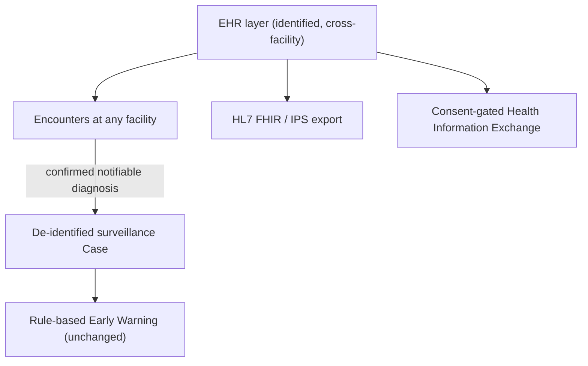

# HealthWatch EHR — Standards & Conformance

HealthWatch is, first and foremost, **a Web-Based Multi-Disease Surveillance and Early Warning System for the Municipality of Lopez, Quezon** (the capstone title). The EHR layer exists to *feed* that surveillance system with real, point-of-care clinical data while giving the municipality a complete, cross-facility health record.

This document records how the system is **design-aligned** to relevant standards. As a capstone prototype it is not formally certified; instead each requirement is mapped to where it is implemented and demonstrable.

## 1. EMR vs EHR vs Surveillance — how the layers relate

The surveillance dashboards, trends, rule-based early-warning engine, and forecasts are unchanged. Auto-generated cases remain fully de-identified (age, age-group, sex, barangay only).

## 2. ISO conformance matrix

| Standard | Scope | Where implemented |
| :--- | :--- | :--- |
| **ISO 13606** (EHR communication / architecture) | Longitudinal, cross-facility record built from facility-attributed encounters and a shared patient index | `Patient`, `Encounter.facilityId`, `Facility` models; cross-facility timeline in the HIE module |
| **ISO 18308** (EHR architecture requirements) | Structured clinical content: encounters, problems, allergies, medications, results, immunizations | EMR models + `backend/src/modules/*` |
| **ISO/HL7 10781** (EHR-S Functional Model) | Direct care, supportive, and information-infrastructure functions (capture, order, document, refer, consent, audit) | Encounter, referral, consent, document, audit modules |
| **ISO 13940 (ContSys)** (continuity of care) | Inter-facility referrals with clinical summary and status lifecycle | `Referral` model + `backend/src/modules/referral` |
| **ISO/TS 22220** (identification of subjects of care) | Multiple typed patient identifiers (PhilHealth, PhilSys, local) + municipality-wide patient code | `Patient.identifiers` (`PatientIdentifier`), `Patient.patientCode` |
| **ISO/TS 27527** (provider identification) | Provider license number and facility assignment | `User.licenseNo`, `User.providerType`, `User.facilityId` |
| **ISO 22600** (privilege management & access control) | Role + facility scoping; consent-directive enforcement for cross-facility access; break-glass | `consent` module (`hasConsent`), `hie` module, `auth.middleware` |
| **ISO 27799 / ISO 27001-2** (health information security) | Access events on PII reads, mutation audit, purpose-of-use, break-glass flag, JWT + bcrypt + helmet + RBAC | `audit.middleware`, `AuditLog` (`purposeOfUse`, `facilityId`, `breakGlass`) |
| **ISO 21090 / HL7 data types** | Coded data with standard code systems (ICD-10, LOINC, SNOMED) | `TerminologyConcept`, `Diagnosis.icd10Code/snomedCode`, `LabResult.loincCode`, FHIR mapper |

## 3. HL7 FHIR R4 resource mapping

Internal records are projected to FHIR on read (no duplicate storage) by `backend/src/modules/fhir/fhir.service.ts`.

| Internal model | FHIR R4 resource | Notes |
| :--- | :--- | :--- |
| `Patient` | `Patient` | identifiers mapped to `identifier[]` (PhilHealth/PhilSys/local) |
| `Facility` | `Organization` | `serviceProvider` / `managingOrganization` references |
| `User` (clinician) | `Practitioner` | referenced from encounters |
| `Encounter` | `Encounter` | `class` = encounter type; `serviceProvider` = facility |
| `VitalSign` | `Observation` (vital-signs) | one Observation per measure, coded with LOINC |
| `LabResult` | `Observation` (laboratory) | LOINC-coded |
| `Diagnosis` | `Condition` | ICD-10 + SNOMED codings; `verificationStatus` from certainty |
| `Problem` | `Condition` | `clinicalStatus` active/resolved |
| `Prescription` item | `MedicationRequest` | one per item with dosage instruction |
| `Immunization` | `Immunization` | |
| `Allergy` | `AllergyIntolerance` | criticality from severity |

**Operations**
- `GET /api/fhir/Patient/:id` — Patient resource
- `GET /api/fhir/Patient/:id/$everything` — full collection Bundle
- `GET /api/fhir/Patient/:id/$summary` — **International Patient Summary** (FHIR `document` Bundle with a `Composition`: Problems, Allergies, Immunizations, Results)
- `POST /api/fhir` — inbound FHIR Bundle import (PHIE / external system)

## 4. Philippine context — PHIE & PhilHealth Konsulta

| PH requirement | HealthWatch mapping |
| :--- | :--- |
| **PhilHealth Konsulta** patient profile (demographics, PIN) | `Patient` demographics + `philhealthNo` + `PatientIdentifier(PHILHEALTH)` |
| Konsulta consultation / first patient encounter | `Encounter` (SOAP) + `VitalSign` + `Diagnosis` |
| Konsulta NCD / maternal / immunization packages | `Problem` (HTN/DM), `MaternalRecord`, `Immunization` |
| **PHIE** interoperability (HL7 FHIR-based exchange) | `fhir` module (FHIR R4 export + Bundle import); IPS document |
| PHIE consent & privacy (RA 10173) | `Consent` directives + consent-gated `hie` access + audit |
| PIDSR notifiable disease reporting | existing surveillance `Case` auto-generated from notifiable confirmed diagnoses |

## 5. Privacy & security summary (RA 10173 / ISO 27799)

- Patient PII is restricted to clinical roles (`ADMIN`, `HEALTH_OFFICER`, `FACILITY_ADMIN`, `PHYSICIAN`, `NURSE`, `MIDWIFE`); BHW and Hospital Encoder see de-identified case data (no patient names). Public forecast endpoints return aggregates only.
- Surveillance cases are **patient-linked** in the database but created only from EMR (registration SUSPECTED + encounter CONFIRMED); manual `POST /api/cases` is disabled.
- Encounters require recorded patient **consent** (`Patient.consentGiven`).
- Cross-facility access via the HIE is governed by `Consent` directives; emergency **break-glass** access is permitted but flagged and audited.
- Every mutation and every PII read is written to `AuditLog` with `purposeOfUse` and `facilityId`.

> HealthWatch remains a surveillance, early-warning, and record-keeping platform. It is NOT a medical diagnostic decision tool.

## 6. Implemented clinical features (P0 + P1)

| ISO 10781 function | Feature | Where implemented |
| :--- | :--- | :--- |
| Capture clinical data | Allergy alerts at prescribing; encounter amend with audit | `EncounterForm`, `encounter.service` |
| Maintain medication list | Active medication list synced from encounters | `Medication` model, `/api/medications` |
| View longitudinal data | Vital sign trends chart | `VitalTrendsChart`, patient chart |
| Capture history | Structured PMH / surgical / family / social | `MedicalHistoryEntry`, `/api/clinical/history` |
| Order management | Lab order workflow (ORDERED → RESULTED) | `LabResult.status`, `/api/labs` |
| Terminology services | Live ICD-10 / LOINC search in clinical UI | `TerminologyCombobox`, `/api/terminology` |
| Document generation | Printable prescription and referral letter (Lopez seal letterhead) | `PrintPreviewModal`, patient chart |
| Case linkage | Patient chart Cases tab; optional notifiable disease at registration | `case-generation.service`, `PatientDetail` |

## 7. Capstone demo script (5 minutes)

1. Open demo patient chart — note allergy banner, vital trends, active meds, pending NS1 lab order.
2. New encounter — search ICD-10 for dengue; add a penicillin-class drug to trigger allergy warning.
3. Enter platelet lab result — observe results list update.
4. Edit an encounter to amend diagnosis — audit logged; no duplicate surveillance case.
5. Print prescription and referral letter.
6. Open Cases list as BHW — confirm no patient names; open patient chart Cases tab as Physician.
